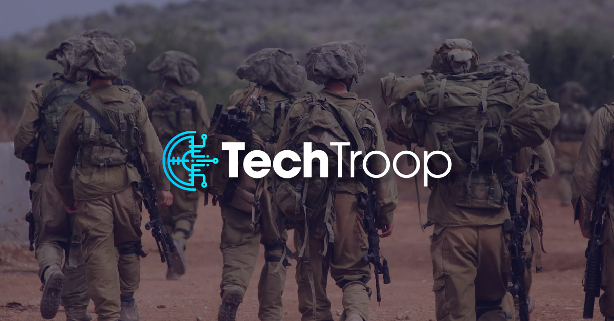

# TechTroop Full Stack Bootcamp 🚀

This repository documents my personal progress in the TechTroop Full Stack Developer Program.

## 💡 What's Inside

- Exercises from lessons
- Independent and group projects
- Hands-on work with the technologies covered in the program

## 🛠️ Technologies Covered

- HTML, CSS, JavaScript
- React, Node.js, Express
- MySQL, REST API
- Git, GitHub, ChatGPT, GitHub Copilot

